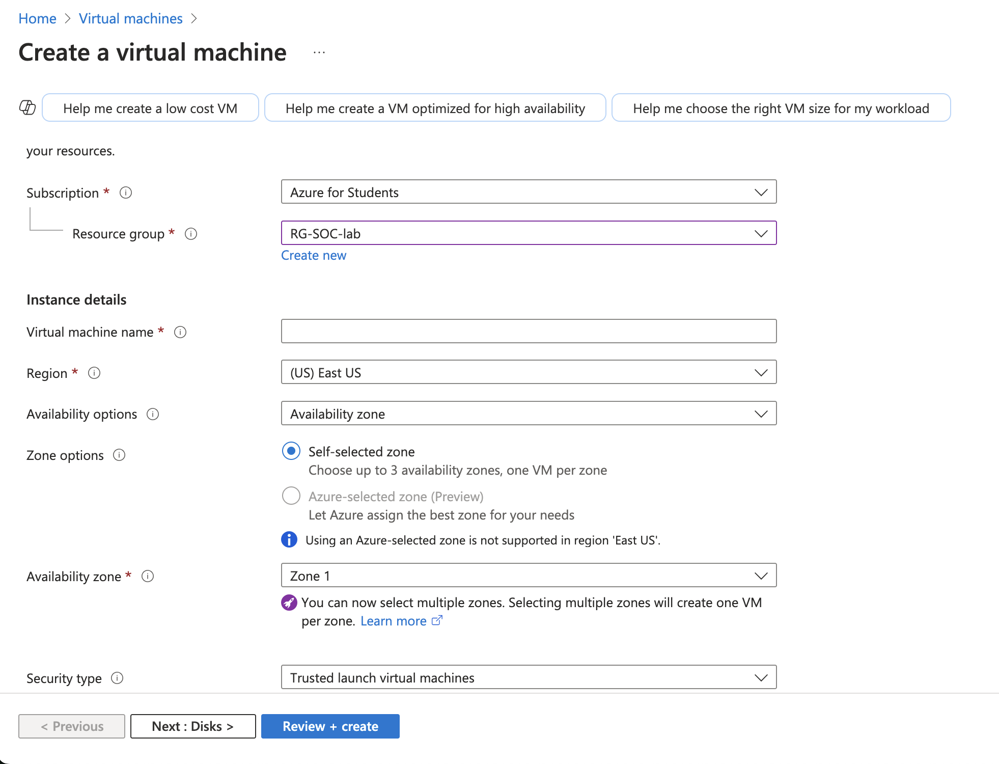
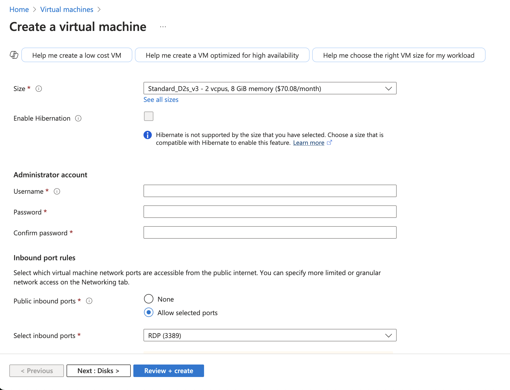
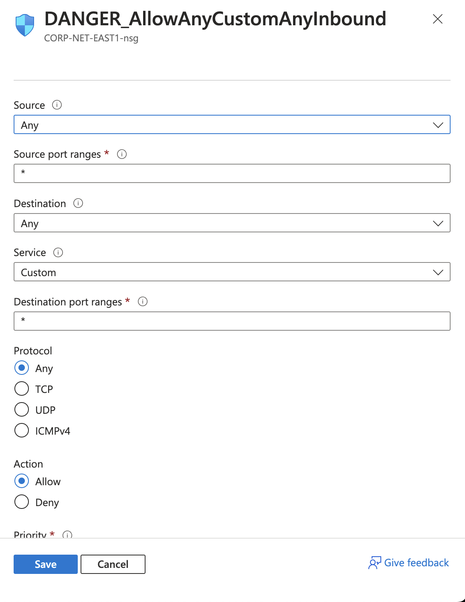
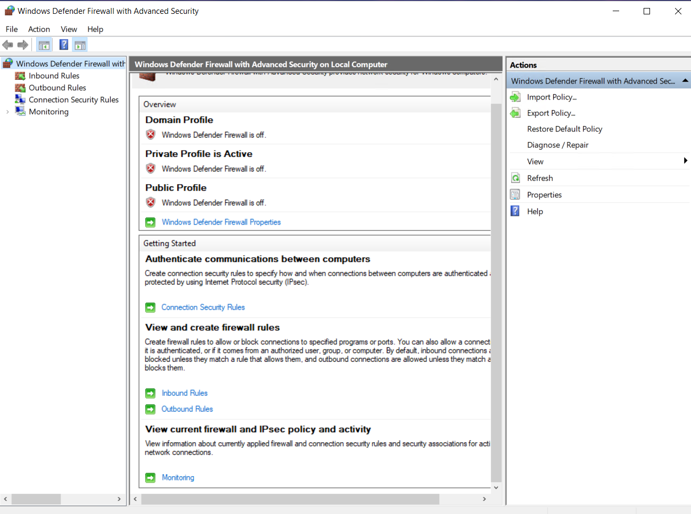
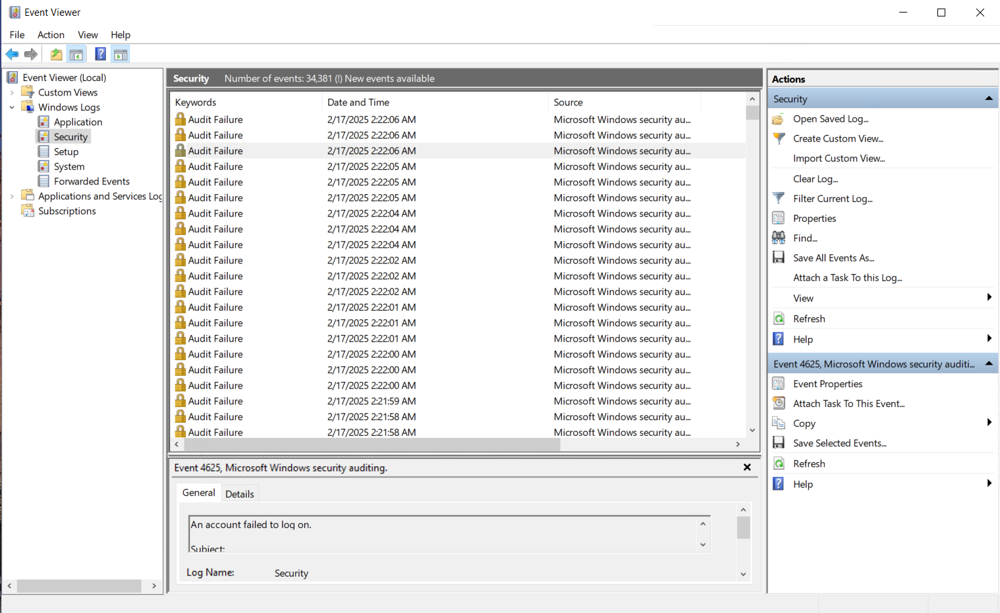
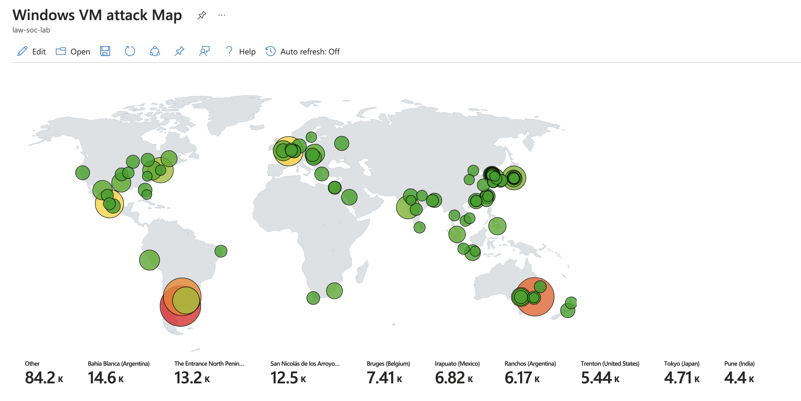

# Azure Honeypot Deployment Guide

This guide walks through setting up a honeypot in **Azure**, forwarding logs, analyzing security events using **KQL**, and enriching logs with **geolocation data**.

---

## Part 1: Setup Azure Subscription

1. **Create a Free Azure Subscription:**  
   👉 [Azure Free Subscription](https://azure.microsoft.com/en-us/pricing/purchase-options/azure-account)  

2. **Login to Azure Portal:**  
   👉 [Azure Portal](https://portal.azure.com)  

---

## Part 2: Create the Honeypot (Azure Virtual Machine)

1. **Go to Azure Portal**  
   👉 [Azure Portal](https://portal.azure.com)  
   - Search for **Virtual Machines**
   - Click **Create New Virtual Machine**  
   - Select **Windows 10**  
   - Choose an appropriate **size**  




2. **Set up Network Security Group:**
   - Navigate to **Networking**
   - **Allow All Inbound Traffic** by creating a new rule



3. **Log into the Virtual Machine & Disable Firewall:**
   - Open **Windows Firewall Settings**:  
     `Start -> wf.msc -> Properties -> Set All to Off`

📌 **Screenshot:**


---

## Part 3: Logging into the VM & Inspecting Logs

1. **Fail 3 login attempts** as “employee” (or another fake username).
2. **Login Successfully** to the VM.
3. **Open Event Viewer**:
   - Navigate to **Security Logs**  
   - Look for **Event ID 4625** (failed login attempts).

📌 **Screenshot:**


---

## Part 4: Log Forwarding & KQL Queries

1. **Create a Log Analytics Workspace**
2. **Create a Sentinel Instance** & **Connect it to Log Analytics**
3. **Configure Log Forwarding**
   - Use **Windows Security Events via AMA** connector.
   - Create a **DCR in Sentinel**.

4. **Query logs using KQL**:
   ```kql
   SecurityEvent
   | where EventId == 4625
   ```

---

## Part 5: Log Enrichment & Finding Location Data

1. **Observe SecurityEvent logs** in Log Analytics Workspace.
2. **Download & Import GeoIP Watchlist**  
   - Download: [assets/geoip-summarized.csv](#)  
   - Import as a **Sentinel Watchlist**
   - Set:
     - **Name/Alias:** geoip  
     - **Source Type:** Local File  
     - **Search Key:** network  
     - **54,000 rows should be imported**


3. **Query with Geolocation Data**:
   ```kql
   let GeoIPDB_FULL = _GetWatchlist("geoip");
   let WindowsEvents = SecurityEvent
       | where IpAddress == <attacker IP address>
       | where EventID == 4625
       | order by TimeGenerated desc
       | evaluate ipv4_lookup(GeoIPDB_FULL, IpAddress, network);
   WindowsEvents
   ```

---

## Part 6: Attack Map Creation

1. **Create a Workbook in Sentinel**
   - Delete the **default elements**
   - Add a **Query element**
   - Go to **Advanced Editor** & Paste JSON from `[assets/map.json]`

2. **Visualize the Attack Map**
   - Observe the **Query**  
   - Adjust the **Map Settings**  
   - Display a **Geolocation-based Attack Map**

📌 **Screenshot:**


---

## 🔥 **Final Thoughts & Skills Gained**
- Setting up **Azure Virtual Machines**  
- Implementing **log forwarding** with **Sentinel & Log Analytics**  
- Writing **KQL queries** to analyze security logs  
- Enriching logs with **geolocation data**  
- Building a **visual attack map** in **Sentinel**
